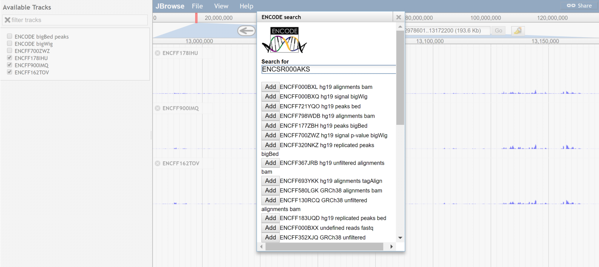

# encodeplugin

A plugin to view data from the ENCODE project

## Screenshot

Figure 1. Example screenshot showing search dialog and bigwig tracks that were loaded remotely from encodeproject.org

## Install

- Clone repo into plugins folder in JBrowse and name folder ENCODEPlugin
- Add "plugins": ["ENCODEPlugin"] to trackList.json or jbrowse_conf.json

Still in beta! Feel free to provide feedback
